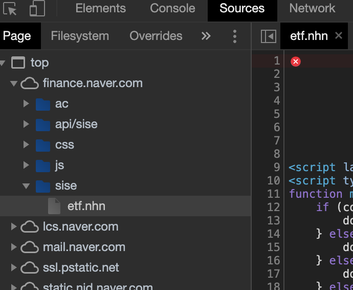

# python 으로 NAVER 증권 data 가져오기
NAVER Finance 에서 ETF 와 ETN 은 api 가 제공되어서, `request` 모듈과 `pandas` 모듈만 갖고 데이터를 분석 할 수 있다.

## 개발 과정
### NAVER Finance API 이용하기
chrome 개발자도구에서 `Sources` 를 확인하면 된다. 아래 그림과 같이 `api/sise` 가 있으면 api 가 존재하는 것이다. 살짝 보았는데 ETF 와 ETN 이외에는 API 를 제공하지 않는 것 같다ㅜㅜ

### python 에서 http request 보내는 방법
`requests` 모듈이 가장 간단하다고 함. 
```bash
pip3 install requests --user
```
**[사용법 참고]**
```python
>>> r = requests.get('https://api.github.com/user', auth=('user', 'pass'))
>>> r.status_code
200
>>> r.headers['content-type']
'application/json; charset=utf8'
>>> r.encoding
'utf-8'
>>> r.text
'{"type":"User"...'
>>> r.json()
{'private_gists': 419, 'total_private_repos': 77, ...}
```
### `pandas.io.json`
json data 를 DataFrame 으로 만듬. 
### Data Frame
pandas 에서 제공하는 row, column 방식의 Data type. (pandas 에서는 1차원 형태로 series 형태의 자료구조도 제공한다.)

## 결론
NAVER Finance 에서 API 를 제공하는 경우는 극히 드무니, `beutifulsoup` 등의 크롤링 도구를 사용 해야 한다.

**[ref]**
[requests](https://requests.readthedocs.io/en/latest/)

## ref
[웬디의 기묘한 이야기 blog](https://wendys.tistory.com/180)